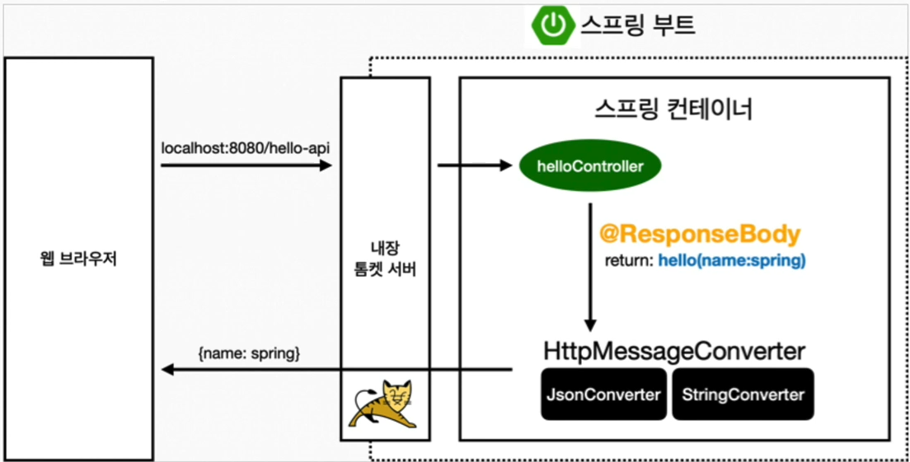

@ResponseBody 사용 원리
====================

* `@ResponseBody`를 사용
	* HTTP의 BODY에 문자 내용을 직접 반환
	* `ViewResolver` 대신에 `HttpMessageConverter`가 동작
	* 기본 문자처리: `StringHttpMessageConverter`
	* 기본 객체처리:  `MappingJackson2HttpMessageconverter`
	* byte처리 등 기타 여러 `HttpMessageConverter`가 기본적으로 등록되어 있음