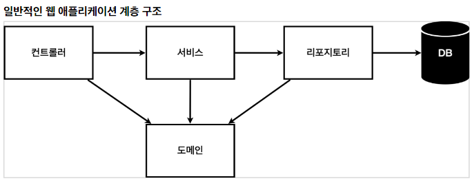
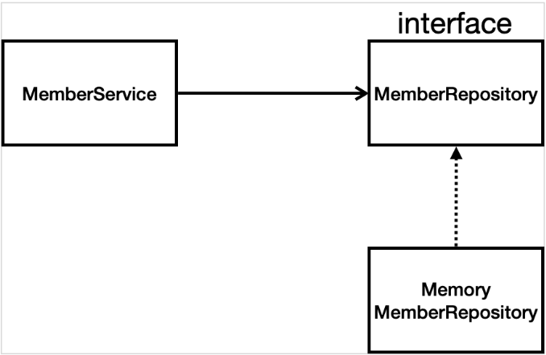

웹 애플리케이션 계층 구조
====================

* 컨트롤러: 웹 MVC의 컨트롤러 역할
* 서비스: 핵심 비지니스 로직 구현
* 레포지토리: DB에 접근, 도메인 객체를 DB에 저장하고 관리
* 도메인: 비지니스 도메인 객체 ex) 회원, 주문, 쿠폰 등 주로 DB에 저장하고 관리됨

* 아직데이터저장소가선정되지않아서, 우선인터페이스로구현클래스를변경할수있도록설계
* 데이터저장소는 RDB, NoSQL 등등다양한저장소를고민중인상황으로가정
* 개발을진행하기위해서초기개발단계에서는구현체로가벼운메모리기반의데이터저장소사용
* 
